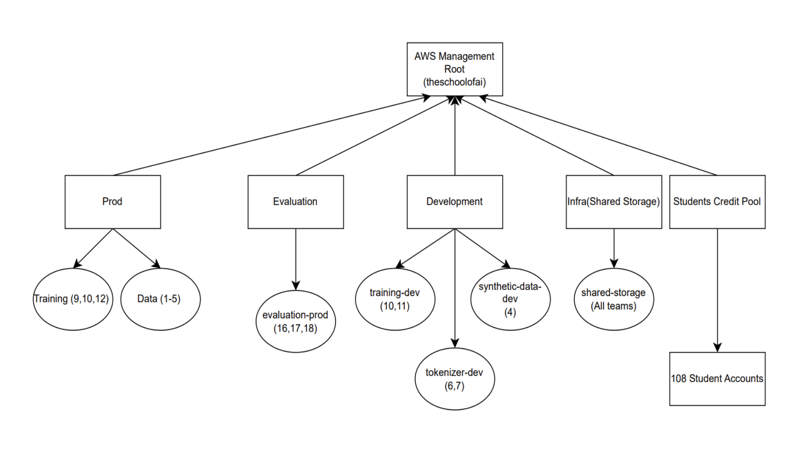
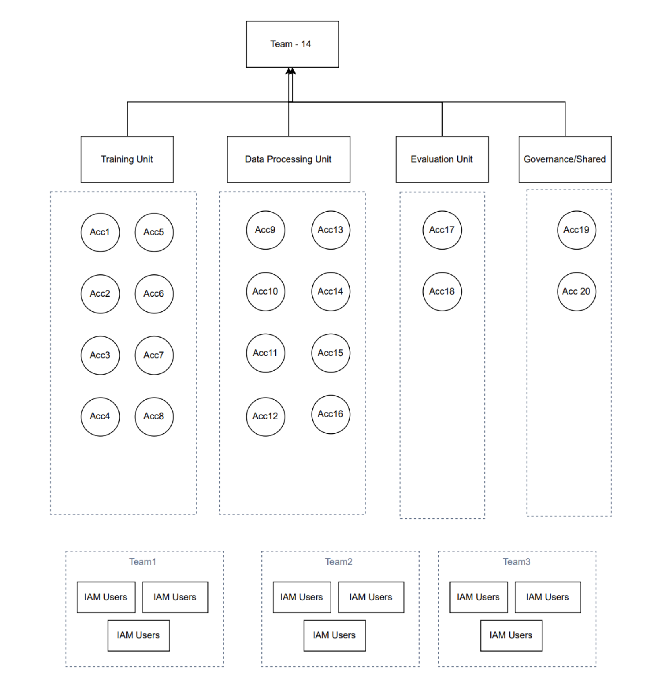

# AWS Account Structure & IAM Strategy

## Plan A (Preferred): Organization & SSO

**Complete Access Control via AWS Organization and AWS IdC.**

Credits are pooled at the Organization Management Account and used for the expenses of Training and Data processing accounts. Access is controlled by setting up Service Control Policies (SCPs) at Organization Units, and permissions are granted to the required teams via AWS IdC permission sets.

More details on Guardrails and permissions can be found [here](https://docs.google.com/spreadsheets/d/1zZKaosEp7SjIGOiq4r-X6CY_gQOcadC82tw0TTAaW-M/edit?gid=2115334098#gid=2115334098).

---

## Plan B: Independent Accounts (No Organization)

**Use this plan if credit pooling is unavailable.**

In this plan, we propose grouping the 20 AWS accounts under different domains:

*   **Training Domain (8 Accounts):** Specifically utilized for training runs.
*   **Data Processing Domain (8 Accounts):** Used for running scripts to perform dataset download, processing, etc.
*   **Evaluation (2 Accounts)**
*   **Governance (2 Accounts):** For managing access to the remaining 20 accounts and storing shared data.

**Credit Allocation:**
Each account will receive **$500 credits**. Once credits are exhausted in one account, resources will be moved to the next available AWS account to continue operations.

### IAM Integration & Access Control
Access to AWS accounts is controlled via **IAM Users**.

*   Each account will have **20 IAM Groups** designed for specific team access.
*   **Provisioning:** When a team requests access, an IAM user is created with a specific naming convention (e.g., `team-x-task-y`) and tagged with task metadata.
*   **Permissions:** The user is added to the respective IAM group to gain permissions with necessary guardrails.
*   **Lifecycle:** Credits are granted at the time of access. Once the task is completed, the IAM user is deleted.

**Resources:**
*   [AWS Setup - Teams, Roles & Access (Spreadsheet)](https://docs.google.com/spreadsheets/d/1zZKaosEp7SjIGOiq4r-X6CY_gQOcadC82tw0TTAaW-M/edit?gid=2115334098#gid=2115334098)

> **Next Steps:** Once we procure the AWS accounts, we’ll launch the respective policies and permission boundaries.
